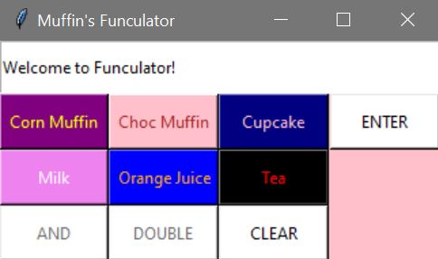

  
  <h1 align="center">Funculator</h1>
  

    It's a calculator but it is not like a regular calculator, but it is a FUN-culator!!

<!-- ABOUT THE PROJECT -->
## About The Project

### Built With

* Python

<!-- GETTING STARTED -->
## The Process and What I have learned

### The Process

  Well, I wanted to do something for fun and to entertain my friend's niece while I was taking a weekend break at her house. So I came up with the fun-culator. 
  

  

I created the interface first using Tkinter and then started adding different functions for each button.

### Lesson Learned

Learning Tkinter is always challenging to me, as there are different layout systems such as pack, grid, and place. It was tricky using one layout system, and then if I get stuck, I might find a solution using a different layout system. So that was challenging, and I didn't want to spend too much time on the interface, so I made it simple as possible.

  

Also, because the logic used for the fun-culator is not logical, I had a few problems having different outputs for different combinations. Nonetheless, my niece loved it playing it, so that was something I achieved!
    

